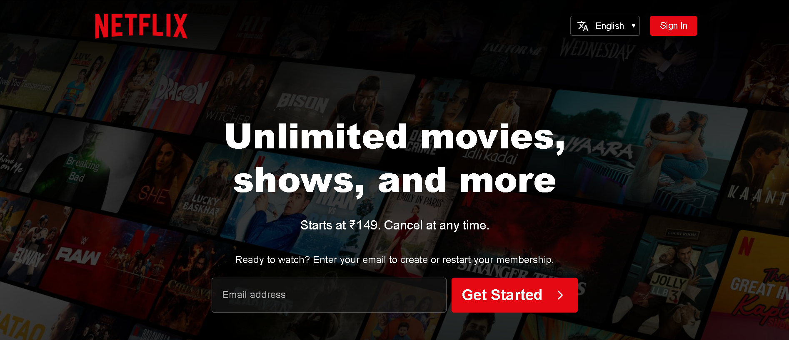
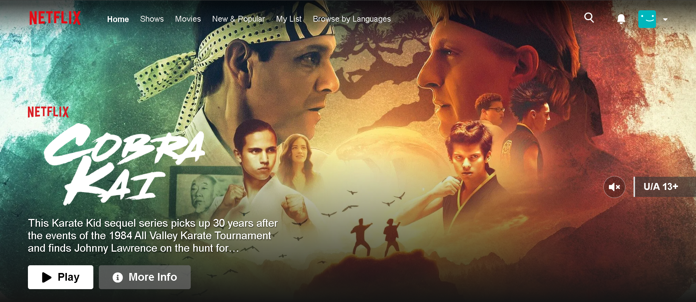

# Netflix India Clone — Engineered for Scale & Performance


[](https://netflixwatch.vercel.app/) 

> **"A pixel-perfect, high-performance replica of the Netflix India immersive experience."**

This project isn't just a UI clone; it's a deep dive into **modern web architecture**. It replicates the core Netflix experience with a focus on **fluid interactions**, **optimized rendering**, and **robust state management**. From the complex z-index layering of hover cards to the imperative control of video players, every detail has been engineered to match the production standard.

---

## 📸 Experience the Immersion

### 🎬 The Landing Experience
*A high-conversion landing page featuring dynamic FAQ accordions, responsive hero sections, and pixel-perfect email capture forms.*



### 🍿 The Browsing Interface
*An infinite canvas of entertainment. Features dynamic ranking rows, "Continue Watching" logic based on user history, and our signature "Explore All" interactive headers.*



---

## 🚀 Key Engineering Highlights

### 1. **Intelligent TMDB Integration & Caching**
We don't just fetch data; we manage it. 
- **Problem**: Hitting TMDB API rate limits (429 Too Many Requests) during rapid scrolling or aggressive pre-fetching.
- **Solution**: Implemented a custom **In-Memory LRU-style Cache** (`src/lib/tmdb.ts`). Requests to `fetchLogo` or `fetchDetails` are cached for 5 minutes, significantly reducing API overhead and latency.

### 2. **Imperative Video Control System**
Standard `autoplay` isn't enough. We needed granular control over the YouTube Player API.
- **Implementation**: Utilized `react-youtube` with generic `playerRef` management in `Billboard.tsx` and `InfoModal.tsx`.
- **Outcome**: Seamless **Audio Sync** (Global Mute State persistence via Zustand), instant play/pause, and prevention of re-renders during state updates.

### 3. **Dynamic "Stranger Things" Experience**
A custom-coded easter egg to replicate Netflix's flagship promotional styles.
- **Logic**: Custom transforms (`scale`, `translate`) applied conditionally to the Billboard component when specific titles are detected.
- **Result**: A cinematic, "zoomed-in" hero state that breaks the grid for maximum visual impact.

### 4. **Robust Profile Architecture**
- **Auth Flow**: Secure JWT-based authentication with `HTTP-Only` cookies (simulated).
- **Profile Management**: Full CRUD operations for user profiles using **PUT/PATCH** methods for robustness.
- **Navigation Guard**: Smart redirection logic ensuring users always land on the "Who's Watching?" gate before accessing content.

---

## 🛠️ The Tech Stack

### **Frontend (Client)**
- **Framework**: Next.js 14 (App Router)
- **Styling**: Emotion (Styled Components) & CSS Modules
- **State Management**: Zustand (Global Store for Profiles, Modals, Auth)
- **Animation**: Framer Motion (Modal transitions, Hover effects)
- **Icons**: React Icons (Fa, Md for authentic iconography)

### **Backend (Server)**
- **Runtime**: NestJS (Node.js)
- **Database**: MongoDB (Mongoose OM)
- **Security**: Passport.js (JWT Strategy), Bcrypt hashing
- **API**: RESTful Architecture

---

## ⚡ Getting Started

### Prerequisites
- Node.js (v18+)
- MongoDB (Local or Atlas URI)

### Installation

1.  **Clone the Monorepo**
    ```bash
    git clone https://github.com/your-username/netflix-clone.git
    cd netflix-clone
    ```

2.  **Setup Backend**
    ```bash
    cd netflix-backend
    npm install
    # Create .env file with MONGO_URI and JWT_SECRET
    npm run start:dev
    ```

3.  **Setup Frontend**
    ```bash
    cd netflix-frontend
    npm install
    # Create .env.local with NEXT_PUBLIC_API_URL and TMDB_API_KEY
    npm run dev
    ```

4.  **Launch**
    Visit `http://localhost:3000` and experience the magic.

---

## 🎨 Design Philosophy
*"If it's not pixel-perfect, it's not finished."*

We strictly adhered to the Netflix Design System (NDS) principles:
- **Typography**: Custom font stacks mimicking Netflix Sans.
- **Motion**: 300ms ease-in-out transitions for that premium "heavy" feel.
- **Visual Hierarchy**: Content-first layout with aggressive whitespace utilization.

---

*Made by Shivam.*
